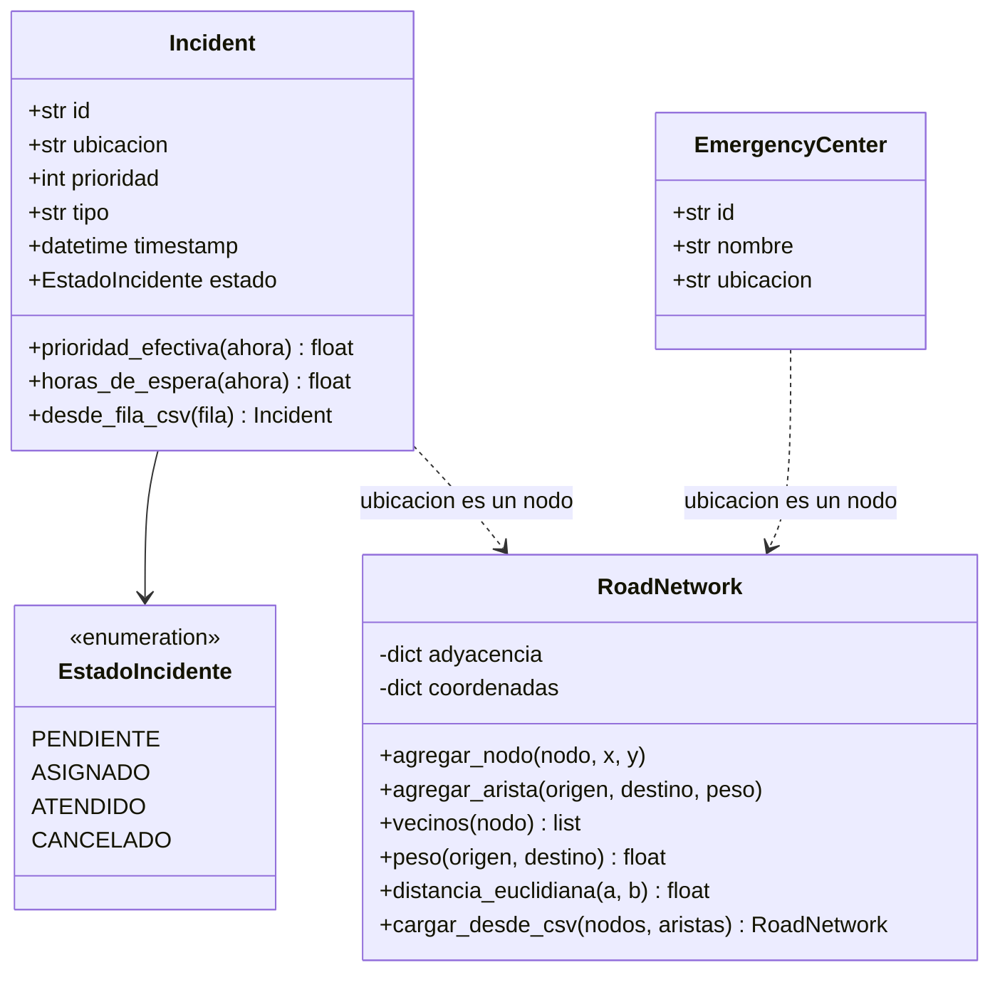

# Parte 1: Modelo de Datos (ADT)

Un **Tipo de Dato Abstracto (ADT)** se define por *qué* operaciones ofrece y
*qué* garantiza cada una (precondiciones, postcondiciones, complejidad), no por
cómo está implementado. Este documento especifica los tres ADT del sistema y
las decisiones de diseño detrás de cada uno.

## Diagrama general



Los tres ADT se conectan a través de la red vial: tanto `Incident.ubicacion`
como `EmergencyCenter.ubicacion` son identificadores de nodos de `RoadNetwork`,
lo que permite calcular rutas entre centros e incidentes.

---

## Incident (`modelos/incidente.py`)

Representa una solicitud de ayuda reportada durante la emergencia. Se
implementa como `@dataclass` porque es fundamentalmente un registro de datos
con dos operaciones derivadas; el estado se modela con un `Enum` para que solo
existan los cuatro valores válidos.

### Atributos

| Atributo | Tipo | Descripción |
|----------|------|-------------|
| `id` | `str` | Identificador único (`I-0001`, `I-0002`, …) |
| `ubicacion` | `str` | Nodo de la red vial donde ocurre (`Z-18`) |
| `prioridad` | `int` | Severidad base del incidente, de 1 a 5 |
| `tipo` | `str` | Categoría (`incendio`, `derrumbe`, `fuga_gas`, …) |
| `timestamp` | `datetime` | Momento del reporte |
| `estado` | `EstadoIncidente` | `PENDIENTE`, `ASIGNADO`, `ATENDIDO` o `CANCELADO` |

### Operaciones

| Operación | Precondición | Postcondición | Complejidad |
|-----------|--------------|---------------|-------------|
| `prioridad_efectiva(ahora)` | `ahora` es un `datetime` | Devuelve `prioridad × (1 + horas_de_espera)`; no modifica el incidente | O(1) |
| `horas_de_espera(ahora)` | `ahora` es un `datetime` | Devuelve las horas transcurridas desde el reporte (≥ 0) | O(1) |
| `desde_fila_csv(fila)` | `fila` contiene las 6 columnas con formatos válidos | Devuelve un `Incident` nuevo equivalente a la fila | O(1) |

### La fórmula de prioridad

El enunciado propone `prioridad = severidad × factor_tiempo`. Se implementó:

```
prioridad_efectiva = prioridad_base × (1 + horas_de_espera)
```

* `prioridad_base` (1–5) captura la severidad intrínseca del incidente.
* El factor `(1 + horas_de_espera)` crece linealmente con el tiempo, de modo
  que **ningún incidente queda relegado para siempre** (anti-inanición): un
  incidente leve que lleva dos días esperando termina superando a uno grave
  recién reportado.
* El `+1` garantiza que un incidente recién creado conserve al menos su
  severidad base (factor 1, no 0).

Ejemplo con la ejecución real: `I-0102` tiene severidad 5 y 71.8 h de espera,
por lo que su prioridad efectiva es `5 × (1 + 71.8) = 364.0`, la mayor de los
520 incidentes.

---

## EmergencyCenter (`modelos/centro_emergencia.py`)

Representa un centro de operaciones desde el cual parten los equipos de
respuesta. Es un `@dataclass(frozen=True)`: los centros no cambian durante la
simulación, e inmutable puede usarse con seguridad como llave o elemento de
conjuntos.

| Atributo | Tipo | Descripción |
|----------|------|-------------|
| `id` | `str` | Identificador (`C-NORTE`, `C-SUR`, …) |
| `nombre` | `str` | Nombre legible (`Centro de Emergencia Norte`) |
| `ubicacion` | `str` | Nodo de la red vial donde se ubica |

No tiene operaciones propias: su rol es anclar los orígenes de las búsquedas
de rutas.

---

## RoadNetwork (`modelos/red_vial.py`)

Modela la red vial como un **grafo no dirigido ponderado** con listas de
adyacencia. Los nodos son intersecciones o localidades, las aristas son
caminos y el peso es el tiempo de desplazamiento en minutos. Además guarda
coordenadas `(x, y)` por nodo para la heurística euclidiana de A*.

### Representación interna

```
adyacencia:  nodo -> [(vecino, peso), (vecino, peso), ...]
coordenadas: nodo -> (x, y)
```

Se eligió lista de adyacencia (y no matriz) porque la red es **dispersa**:
55 nodos y 115 aristas frente a las 1 485 parejas posibles. La lista usa
O(V + E) memoria y permite iterar los vecinos de un nodo en tiempo
proporcional a su grado, que es lo que necesitan BFS, Dijkstra y A*.

### Operaciones

| Operación | Precondición | Postcondición | Complejidad |
|-----------|--------------|---------------|-------------|
| `agregar_nodo(nodo, x, y)` | - | El nodo existe; si ya existía no se duplica; coordenadas registradas si se dieron | O(1) |
| `agregar_arista(o, d, peso, bidireccional)` | `peso ≥ 0` | Ambos nodos existen y la arista aparece en la adyacencia de `o` (y de `d` si es bidireccional) | O(1) |
| `vecinos(nodo)` | - | Lista de pares `(vecino, peso)`; vacía si el nodo no existe | O(1) |
| `peso(o, d)` | - | Peso de la arista directa o `None` si no hay | O(grado(o)) |
| `existe_nodo(nodo)` | - | `True` si el nodo está en el grafo | O(1) |
| `nodos()` | - | Lista con todos los identificadores de nodos | O(V) |
| `coordenadas(nodo)` | - | Par `(x, y)` o `None` | O(1) |
| `distancia_euclidiana(a, b)` | - | Distancia en línea recta en km, o `None` si falta alguna coordenada | O(1) |
| `cargar_desde_csv(nodos, aristas)` | Archivos con columnas `id,x,y` y `origen,destino,tiempo_minutos` | Devuelve la red completa | O(V + E) |

### Invariantes

1. Toda arista conecta nodos que existen en `adyacencia` (garantizado porque
   `agregar_arista` crea los nodos que falten).
2. En modo bidireccional, `(d, peso)` está en la lista de `o` si y solo si
   `(o, peso)` está en la lista de `d`.
3. `numero_aristas` cuenta aristas lógicas: una arista bidireccional se cuenta
   una sola vez aunque aparezca en dos listas de adyacencia.

### Nota sobre el uso de `dict`

La restricción "no usar `dict`" del enunciado aplica a la **tabla hash de la
Parte 2**, que es la estructura que debía implementarse desde cero (y así se
hizo, ver [02_tabla_hash.md](02_tabla_hash.md)). Para la adyacencia del grafo
se usa el diccionario nativo, como es estándar; de hecho la cola de prioridad
de la Parte 3 sí reutiliza la `TablaHash` propia como índice interno para
demostrar su uso como componente.
