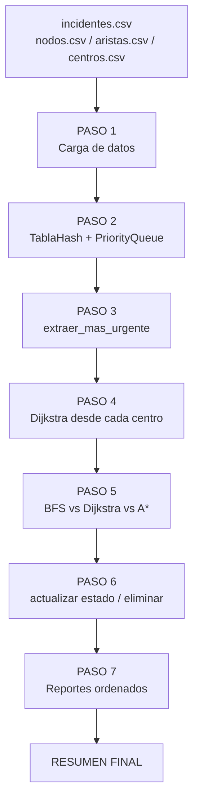

# Parte 7: Escenario integrado (`main.py`)

`main.py` ejecuta el flujo completo exigido por el enunciado, integrando todas
las piezas del sistema. Cada paso imprime evidencia verificable.



## Paso a paso

### Paso 1: Carga

Se leen los cuatro CSV: 520 incidentes, 4 centros y la red de 55 nodos y 115
aristas. La **hora de referencia** para calcular esperas es el timestamp del
incidente más reciente (`2026-07-04 11:59`), lo que hace la corrida
reproducible sin depender del reloj del sistema.

### Paso 2: Inserción en las estructuras

Cada incidente se inserta en la `TablaHash` (clave = id) y en la
`PriorityQueue` (prioridad = `prioridad_efectiva`). Se imprimen las métricas
de la tabla:

```
Tabla hash:  520 elementos en 1361 buckets
  Factor de carga:  0.382   Colisiones: 307
  Buckets usados:   484     Bucket maximo: 3
```

y el **Top-10 de incidentes críticos** vía `top_k(10)` - los diez son
severidad 5 con 64–72 h de espera, coherente con la fórmula de prioridad.
Además se demuestra `actualizar_prioridad`: el incidente `I-0100` se
"reclasifica" duplicando su prioridad (47.6 → 95.2) y la cola se reordena en
O(log n).

### Paso 3: Extracción del más urgente

```
Incidente: I-0102   (incendio en Z-18)
  Prioridad base 5, 71.8 h de espera -> prioridad efectiva 364.0
```

`extraer_mas_urgente()` lo saca de la cola en O(log n). Nótese que también
era el primero del Top-10 y del reporte ordenado por QuickSort: tres caminos
independientes que coinciden.

### Paso 4: Centro más cercano

Se ejecuta Dijkstra **desde cada centro** hacia `Z-18` y se elige el de menor
costo:

| Centro | Costo (min) | Tramos | Visitados |
|--------|-------------|--------|-----------|
| C-NORTE | 84.6 | 4 | 23 |
| **C-SUR** | **67.9** | 3 | 23 |
| C-ORIENTE | 72.0 | 4 | 17 |
| C-PONIENTE | 68.7 | 4 | 20 |

Con 4 centros son 4 búsquedas de ~0.2 ms; la solución es simple y exacta.

### Paso 5: Comparación de algoritmos

Sobre el par elegido (`C-SUR → Z-18`) se ejecutan BFS, Dijkstra y A*. Los
tres encuentran la misma ruta en este caso, pero A* expande 9 nodos frente a
23 de Dijkstra y 33 de BFS (análisis completo en
[06_algoritmos_busqueda.md](06_algoritmos_busqueda.md)).

```
Ruta sugerida (3 tramos): C-SUR -> Z-38 -> Z-29 -> Z-18
```

### Paso 6: Mantenimiento de la tabla hash

Se demuestran las operaciones restantes de la Parte 2 sobre datos vivos:

* `actualizar`: el estado de `I-0102` pasa a `asignado` y se verifica con
  `buscar`.
* `eliminar`: `I-0008` se elimina (simulando una cancelación); la búsqueda
  posterior devuelve `None` y el conteo baja a 519.

### Paso 7: Reportes

Los tres reportes de la Parte 4 sobre los datos completos: más antiguos
(MergeSort por timestamp), más críticos (QuickSort por prioridad efectiva) y
zonas más afectadas (conteo con `TablaHash` + MergeSort por frecuencia).

### Resumen final

```
Incidente asignado: I-0102 (incendio en Z-18)
Prioridad:          364.0
Centro asignado:    Centro de Emergencia Sur
Ruta sugerida:      C-SUR -> Z-38 -> Z-29 -> Z-18
Costo total:        67.9 minutos
Tiempo estimado:    1h 08m
```

Los cinco campos exigidos por el enunciado (incidente, prioridad, ruta, costo
total y tiempo estimado) quedan en pantalla.

## Estructuras y algoritmos usados por paso

| Paso | Estructura / algoritmo | Operación clave |
|------|------------------------|-----------------|
| 1 | `Incident.desde_fila_csv`, `RoadNetwork.cargar_desde_csv` | Parsing O(n), O(V+E) |
| 2 | `TablaHash`, `PriorityQueue` | `insertar` O(1) / O(log n); `top_k`; `actualizar_prioridad` |
| 3 | `PriorityQueue` | `extraer_mas_urgente` O(log n) |
| 4 | Dijkstra × 4 centros | O((V+E) log V) cada una |
| 5 | BFS, Dijkstra, A* | Comparación de expansiones y costos |
| 6 | `TablaHash` | `actualizar`, `eliminar`, `buscar` O(1) |
| 7 | MergeSort, QuickSort, `TablaHash` | Reportes O(n log n) |
